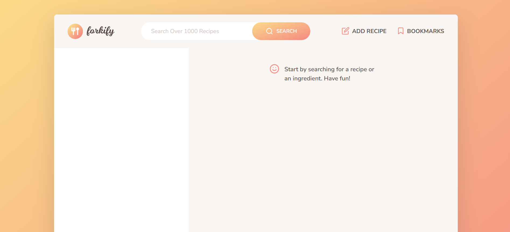
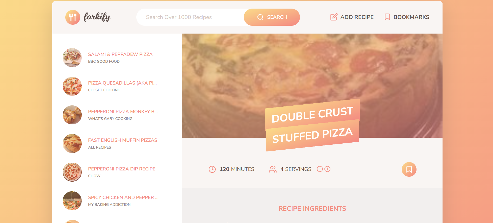
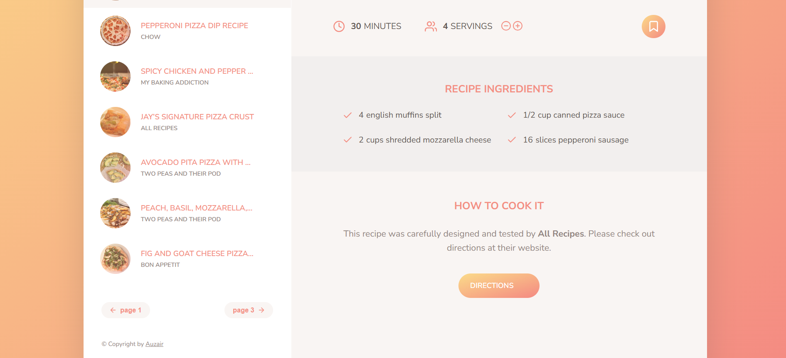

# Forkify

Is an advanced JavaScript application in which users can search through cooking recipes i.e pizza.

- This web application is not mobile responsive, so open the demo in desktop view

---

## Live Demo

https://forkify-auzair.netlify.app/

---

## Screenshots





---

## Features

- Architected in MVC (Model View Controller)
- Recipe data is fetched from an external API
- Search result is paginated
- Uses a DOM updating algorithm for rendering UI
- Uses local storage to store bookmarks

## Technologies Used

- Forkify API
- JavaScript
- Sass
- HTML & CSS

---

## Installation

### Step 1: Clone the repository

```bash
git clone https://github.com/auzair-17/forkify-js-recipe-app.git
```

### Step 2: Go to project directory

```bash
cd forkify-js-recipe-app
```

### Step 3: Install dependencies

```bash
npm install
```

### Step 4: Start development server

```bash
npm run dev
```

## Author

**Auzair**

- Github: https://github.com/auzair-17
